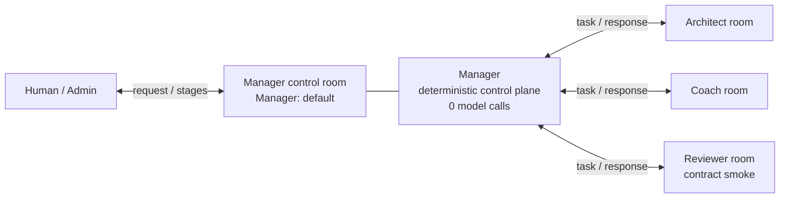

# Awakening AgentTeams Demo

[中文说明](README.md) · [English](README.en.md) · [Contributing](CONTRIBUTING.md) · [Support](SUPPORT.md) · [Security Policy](SECURITY.md)

[GitHub repository](https://github.com/yongjiajie337-tech/awakening-agentteams-demo) · [stable open-source release v1.0.3](https://github.com/yongjiajie337-tech/awakening-agentteams-demo/tree/v1.0.3) · [immutable competition baseline v1.0.2](https://github.com/yongjiajie337-tech/awakening-agentteams-demo/tree/v1.0.2) · [changelog](CHANGELOG.md)

Awakening AgentTeams Demo is an open-source, dual-layer review package for a real `1 Manager + 3 Worker` AgentTeams flow. It separates two different claims:

1. code, contracts, sanitized evidence, and hashes that anyone can inspect offline; and
2. a live multi-agent flow that can be triggered again only in a prepared, compatible AgentTeams reference environment.

The scenario is a fictional job-seeker evidence workflow. The Architect identifies role/project gaps, the Coach reviews execution and evidence preparation, and the Reviewer performs a narrowly scoped contract smoke check over a closed synthetic package. The reusable part is the topology, identity and permission boundaries, structured handoffs, state discipline, and audit trail. Moving it to training, software quality, support tickets, or another domain requires new domain facts, rubrics, Skills, Schemas, and write policies; this repository does not claim those migrations are already implemented.

> Scope boundary: this is a competition Demo and reproduction package. It is not M5 acceptance evidence, a production deployment, or a zero-configuration AgentTeams installer.

## 60-second judge tour

If you only open four pages, use this order:

| Time | Open | Question answered |
|---:|---|---|
| 20 s | [Plain-language multi-agent guide](docs/JUDGE_GUIDE.en.md) | Why this is not one four-agent group chat, and what each room shows |
| 20 s | [Nine-Skill overview](docs/SKILLS_OVERVIEW.en.md) | What each Skill does and why the accurate scope is `3 live + 3 contract_only + 3 deny_only` |
| 10 s | [Run B evidence](EVIDENCE.md#run-b最终录屏对应运行) | How 3/3 Workers, three Provider calls, and eight Manager-room Matrix stage projections are evidenced |
| 10 s | [Three Run B canonical Worker outputs](evidence/run-b/outputs/) | What the three distinct roles actually returned |

In one sentence: `Manager: default` is a Human/Admin-to-Manager control room, not an inbox that automatically contains every Manager conversation. The Manager dispatches separately through three Worker rooms; complete structured Worker replies remain on their own paths, while the Manager room mainly displays dispatch, completion, and a `summary-completed` status/result-hash projection. The deterministic full aggregate is stored in `result.json`; the Demo does not generate a separate human-readable synthesis.



## What is real, and what is not claimed

| Topic | Accurate repository claim |
|---|---|
| Topology | Two successful live runs used `1 Manager + 3 Worker`: Architect, Coach, and Reviewer |
| Manager | A deterministic policy-and-contract control plane with `0` model calls; no claim of LLM-selected routing, tools, or replanning |
| Worker calls | Each successful run contains one Provider call per Worker and three structured Worker results |
| Reviewer | A real live call, but only in `contract_smoke` mode; not a formal business review, fact verification, or M5 acceptance |
| Visualization | Matrix/Element rooms retain Manager-to-Worker messages and lifecycle events |
| Packaged evidence | Two sanitized run projections and six canonical Worker outputs can be checked offline for internal consistency |
| Cost | Locally calculated from recorded tokens and fixed prices; not independently reconciled against a remote Provider bill |
| Reproduction | Offline verification is independent; live reproduction requires a prepared AgentTeams v1.1.2-compatible reference environment |

The current stable open-source release is Git tag [`v1.0.3`](https://github.com/yongjiajie337-tech/awakening-agentteams-demo/tree/v1.0.3). Git tag [`v1.0.2`](https://github.com/yongjiajie337-tech/awakening-agentteams-demo/tree/v1.0.2) remains the immutable competition-evidence baseline. Future work listed as `Unreleased` is not a stable release until it is verified, merged, and tagged.

## Architecture at a glance

```text
Human / fixed synthetic request
              |
              v
Manager: default
(deterministic policy/contract control plane; 0 model calls)
  |---------------- Architect Worker --> structured role-gap output
  |---------------- Coach Worker ------> structured coaching output
  `---------------- Reviewer Worker ---> contract-smoke output
              |
              v
deterministic summary + Matrix/Element event flow + evidence hashes
```

The Manager uses a frozen role-to-Skill mapping, creates three task packages, dispatches the Workers concurrently, validates and correlates the results, and emits a fixed summary. It does **not** ask a model which Worker to select, which tool to call, or how to revise the plan.

The three Workers communicate with the Manager through separate rooms. They do not need to be placed in one four-party group chat. The Manager room primarily shows lifecycle projections, including a `summary-completed` status/result hash, while each Worker room retains that Worker's structured request and response. The deterministic aggregate is stored in `result.json`, not authored as a human-readable synthesis. See [docs/ARCHITECTURE.md](docs/ARCHITECTURE.md).

## Reviewer boundary

`review_evidence_against_rubric` is the third live Worker call, but its purpose in this Demo is intentionally narrow:

- it receives a closed synthetic fixture;
- it has no callable tool;
- it returns `reviewer_mode=contract_smoke`;
- `business_evaluation=false` and `verified_claim_created=false` are required;
- it checks that the input/output contract closes and produces a bounded observation.

Therefore, a successful Reviewer result proves that the live Reviewer path and structured contract worked. It does not prove that a real person's evidence is sufficient, that a business claim is true, or that M5 passed acceptance.

## Packaged run evidence

The repository includes sanitized projections from two successful Demo runs:

- **Run A:** 3/3 Workers succeeded; 3 successful Worker Provider calls; 0 Manager model calls; locally calculated cost `CNY 0.007176`.
- **Run B:** 3/3 Workers succeeded; 3 successful Worker Provider calls; 0 Manager model calls; locally calculated cost `CNY 0.005740`.

Each run has eight Manager-control-room Matrix stage projections: `request-accepted ×1`, `worker-dispatched ×3`, `worker-completed ×3`, and `summary-completed ×1`. This count excludes the original Human request and Worker-room tasks/responses. Both runs recorded a process-local maximum of three in-flight Provider calls and no retry. The public projection does not include per-call timestamps, so a third party can verify the projection's internal hash consistency but cannot independently replay timing and derive that peak from the projection alone.

Each `evidence/run-*/outputs/` directory contains three canonical Worker outputs extracted from the frozen result. Offline verification canonicalizes them again, compares their SHA-256 values with `provider-events.jsonl`, and validates them against the corresponding output Schemas. The raw Provider transport package, complete prompts, unrelated Matrix history, and remote billing data are not distributed.

See [EVIDENCE.md](EVIDENCE.md) for IDs, hashes, provenance, and limitations.

## Offline verification

Use a clean Git checkout or a fresh extraction of a stable release archive:

```powershell
git clone https://github.com/yongjiajie337-tech/awakening-agentteams-demo.git
Set-Location .\awakening-agentteams-demo
```

### Recommended Full mode

On Windows PowerShell 5.1 or PowerShell 7, create the locked Python 3.12 environment **outside** the repository and run:

```powershell
py -3.12 -m venv ..\.venv-awakening-demo-review
..\.venv-awakening-demo-review\Scripts\python.exe -m pip install -r .\requirements-demo.lock
.\verify_offline.ps1 -Mode Full -PythonPath '..\.venv-awakening-demo-review\Scripts\python.exe'
```

Creating the environment and installing dependencies may access a Python package index. After installation, the verifier itself does not start Docker, access the network, read a Provider Secret, or create model cost. It checks package structure, non-secret configuration samples, evidence and hashes, and runs the bundled focused Demo/M4 tests. The exact test count is printed at runtime; this is not a full line- or branch-coverage claim for `src/awakening/`.

### No-third-party dependency mode

If third-party Python packages are not installed, prefer `Stdlib`:

```powershell
.\verify_offline.ps1 -Mode Stdlib
```

It still runs the package verifier and the standard-library-only tests. A Git-for-Windows-Bash-specific negative test is reported as skipped when that Bash is unavailable.

For a fast manifest, hash, evidence, and sensitive-file check with no unittest execution:

```powershell
.\verify_offline.ps1 -Mode PackageOnly
```

`PackageOnly` explicitly reports that unit tests were not run. It is not a substitute for `Stdlib` or `Full`. See [QUICKSTART_WINDOWS.md](QUICKSTART_WINDOWS.md) and [docs/TROUBLESHOOTING.md](docs/TROUBLESHOOTING.md).

## Live reproduction boundary

Live reproduction is not a command for an arbitrary laptop. It requires an already prepared AgentTeams v1.1.2-compatible workspace that supplies Matrix, the expected containers and identities, protected internal credentials, and Provider configuration.

Begin with the read-only runbook and the bounded preflight:

```powershell
.\run_demo.ps1 -Mode PrintRunbook
$demoRunId = [guid]::NewGuid()
.\run_demo.ps1 -Mode Preflight `
  -ReferenceWorkspace 'D:\path\to\compatible-reference-workspace' `
  -DemoRunId $demoRunId `
  -IUnderstandThisUsesDockerAndNetwork `
  -IUnderstandThisChangesReferenceState
```

`Preflight` does not call a model or read Secret values, but it performs a public transport probe, read-only Docker queries, and creates a fresh evidence directory in the reference workspace. Subsequent `LiveStep` stages may read protected runtime credentials and Provider configuration, change reference-environment state, make Provider calls, and incur cost. Read [docs/REFERENCE_ENVIRONMENT.md](docs/REFERENCE_ENVIRONMENT.md), [QUICKSTART_WINDOWS.md](QUICKSTART_WINDOWS.md), and [SECURITY_AND_SECRETS.md](SECURITY_AND_SECRETS.md) before using live mode.

| Reproduction layer | Independent? | Docker/network/Secret? | What it can establish |
|---|---:|---:|---|
| Offline verification | Yes | No | Repository/package integrity, selected tests, evidence consistency, and absence of obvious secret files |
| Prepared reference environment | No | Yes | A new live `1+3` flow in a compatible environment |
| Zero-config clean-machine deployment | Not provided | — | No such claim is made |

## Repository map

| Need | Location |
|---|---|
| Entry points | `verify_offline.ps1`, `run_demo.ps1` |
| Dependency description | `requirements-demo.lock`, `pyproject.toml`, `QUICKSTART_WINDOWS.md` |
| Non-secret configuration | `config/`, `infra/agentteams/m4/` |
| Synthetic examples | `examples/input/`, `examples/output/` |
| Sanitized evidence | `evidence/run-a/`, `evidence/run-b/`, `EVIDENCE.md` |
| Agent identities and Skills | `agents/`, `skills/` |
| Contracts and Schemas | `contracts/`, `schemas/` |
| Runtime closure | `src/awakening/`, `scripts/demo/`, `scripts/m4/` |
| Focused offline tests | `tests/unit/demo/`, `tests/unit/m4/` |

Nine Skills are distributed, but they were not all live-called: the accurate activation statement is `3 live + 3 contract_only + 3 deny_only`, and the third live Skill is the Reviewer contract smoke. The complete table is in [docs/ARCHITECTURE.md](docs/ARCHITECTURE.md).

## Security and privacy

Never commit API keys, Gateway keys, passwords, Matrix tokens, `.env` files, databases, personal evidence, or raw runtime directories. Offline mode is designed not to read Provider Secrets or incur model cost. Live mode is a separate, explicitly acknowledged operation with a known compatibility limitation documented in [SECURITY_AND_SECRETS.md](SECURITY_AND_SECRETS.md). The detailed threat model and engineering boundaries are documented in [docs/SECURITY_MODEL.md](docs/SECURITY_MODEL.md).

For ordinary support, see [SUPPORT.md](SUPPORT.md). Report a suspected vulnerability or Secret exposure through [SECURITY.md](SECURITY.md); do not publish vulnerability details, credentials, or personal data in a public Issue or Pull Request.

## Contributing, citation, and license

First-time contributors are welcome. [CONTRIBUTING.md](CONTRIBUTING.md) explains how to choose a small issue, create a branch, run the appropriate verification mode, and open a Pull Request. Participation is governed by [CODE_OF_CONDUCT.md](CODE_OF_CONDUCT.md).

Citation metadata is available in [CITATION.cff](CITATION.cff). Code is provided under the [Apache License 2.0](LICENSE); third-party attribution and distribution boundaries are documented in [NOTICE.md](NOTICE.md).

## Related documents

- [Chinese main README](README.md)
- [Architecture](docs/ARCHITECTURE.md)
- [Evidence index and limitations](EVIDENCE.md)
- [Windows quick start](QUICKSTART_WINDOWS.md)
- [Reference environment](docs/REFERENCE_ENVIRONMENT.md)
- [Troubleshooting](docs/TROUBLESHOOTING.md)
- [Security Policy and vulnerability reporting](SECURITY.md)
- [Detailed Security Model](docs/SECURITY_MODEL.md)
- [Security and Secrets](SECURITY_AND_SECRETS.md)
- [Contributing](CONTRIBUTING.md)
- [Support](SUPPORT.md)
- [Changelog](CHANGELOG.md)
