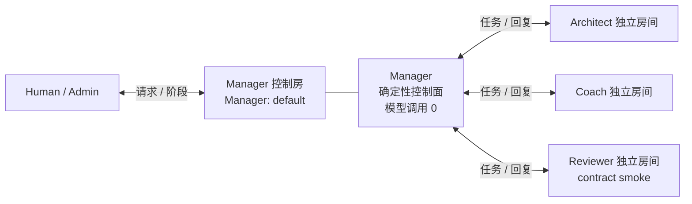

# Awakening AgentTeams Demo

[中文说明](README.md) · [English](README.en.md) · [贡献指南](CONTRIBUTING.md) · [获取帮助](SUPPORT.md) · [安全政策](SECURITY.md)

[GitHub 仓库](https://github.com/yongjiajie337-tech/awakening-agentteams-demo) · [稳定开源版本 v1.0.3](https://github.com/yongjiajie337-tech/awakening-agentteams-demo/tree/v1.0.3) · [不可变比赛基线 v1.0.2](https://github.com/yongjiajie337-tech/awakening-agentteams-demo/tree/v1.0.2) · [更新记录](CHANGELOG.md)

这是 Awakening 的 AgentTeams 开源 Demo，也是面向赛事初赛评审的 **双层评审包**。它把“无需真实调用即可检查的代码与证据”和“需要兼容参考环境才能再次触发的真实多 Agent 流程”明确分开。

**场景价值与迁移边界：** Awakening 面向“知道目标岗位、却难以把零散经历转成可验证项目证据”的个人求职者：Architect 对照岗位要求识别缺口，Coach 检查任务与证据准备，Reviewer 在本 Demo 中只做封闭合成包的契约冒烟检查。迁移到培训、研发质量或客服工单等场景时，可复用 Manager/Worker 拓扑、身份权限、结构化交接、状态与审计机制，但必须替换领域事实、评价标准、Skill/Schema 和业务写入政策；本包没有证明这些行业迁移已经落地，也不把 synthetic 结果当作真实用户成效。

本包展示一条固定、可审计的演示链路：1 个 Manager 作为**确定性的策略/契约控制面**，按冻结的角色—Skill 映射生成三份任务包，并发分派给 3 个职责与边界不同的 Worker（Architect、Coach、Reviewer），收集三份结构化结果，并在 Matrix/Element 中留下可视化消息与生命周期证据。Manager 不调用模型，也不支持由模型自主决定路由、工具或执行计划；这里的确定性编排不能扩大表述为 LLM 自主规划。

> 重要边界：这是竞赛 Demo 与复现材料，不是 M5 模块验收证据；它也不宣称可在任意裸机上零配置一键部署 AgentTeams。

## 评委 60 秒导览

如果只看四个入口，请按这个顺序：

| 用时 | 先看什么 | 立即能回答的问题 |
|---:|---|---|
| 20 秒 | [多 Agent 3 分钟导览](docs/JUDGE_GUIDE.md) | 为什么不是四 Agent 群聊、Manager 房和 Worker 房分别显示什么 |
| 20 秒 | [9 个 Skill 一页总览](docs/SKILLS_OVERVIEW.md) | 9 个 Skill 分别做什么，为什么准确口径是 `3 live + 3 contract_only + 3 deny_only` |
| 10 秒 | [Run B 成功证据](EVIDENCE.md#run-b最终录屏对应运行) | 3/3 Worker、3 次 Provider 调用、8 条 Manager 控制房阶段投影如何被证明 |
| 10 秒 | [Run B 三份 canonical Worker 输出](evidence/run-b/outputs/) | 三个不同角色实际返回了什么结构化结果 |

一句话理解协作方式：`Manager: default` 只是 Human/Admin 与 Manager 交互的控制房间，不是 Manager 所有对话的总收件箱。Manager 分别通过三个独立 Worker 房间向 Architect、Coach、Reviewer 派发任务；Worker 的完整结构化回复保留在对应路径，完整三路结果由 `result.json` 确定性聚合，Manager 房主要显示派发、完成和 `summary-completed` 状态/结果哈希投影，并不会另写一段人类可读的综合摘要。



对应赛事页面：[世界人工智能开源大赛 · GOAI Agent Infra 赛道](https://www.goaihz.com/tracks?track=infra)。本包用下表把初赛代码包的五项建议内容逐一落到可检查文件。

## 先看结论：哪些是真实的，哪些没有声明

| 项目 | 本仓库的准确声明 |
|---|---|
| 多 Agent 拓扑 | 真实运行过 `1 Manager + 3 Worker`；三个 Worker 分别是 Architect、Coach、Reviewer |
| Manager | 确定性的策略/契约控制面，模型调用为 `0`；不声称 LLM 自主选人、选工具或重规划 |
| Worker 调用 | 两轮成功 Demo 中，每轮三个 Worker 各有一次 Provider 调用，均返回结构化结果 |
| Reviewer | 真实调用，但范围是 `contract_smoke`；不等同于正式业务评审、事实核验或 M5 验收 |
| 可视化 | Matrix/Element 中保留 Manager 与各 Worker 房间、阶段事件和结果流转 |
| 运行证据 | 随仓库提供两轮脱敏安全投影及六份 canonical Worker 输出，可离线校验内部一致性 |
| 费用 | 只提供按记录 token 与固定单价计算的本地结果；没有用远端账单独立核验 |
| 复现 | 离线核验可独立运行；实时流程需要已准备好的 AgentTeams v1.1.2 兼容参考环境 |

当前稳定开源版本是 Git 标签 [`v1.0.3`](https://github.com/yongjiajie337-tech/awakening-agentteams-demo/tree/v1.0.3)。[`v1.0.2`](https://github.com/yongjiajie337-tech/awakening-agentteams-demo/tree/v1.0.2) 继续作为不可变的比赛证据基线保留；后续改进仍须先进入开发分支和 `Unreleased` 更新记录，完成核验、合并并创建新标签后才成为新的稳定发布。

## 评委从哪里开始

可以从 GitHub 克隆仓库，也可以下载稳定标签对应的发布归档。为避免历史文件或本机缓存干扰严格清单核验，请使用一个**干净 checkout/全新解压目录**，并在手动执行 Python import、自定义 unittest 或其他代码检查之前运行核验入口：

```powershell
git clone https://github.com/yongjiajie337-tech/awakening-agentteams-demo.git
Set-Location .\awakening-agentteams-demo
```

Windows PowerShell 5.1 或 PowerShell 7 中，先在**仓库目录外**创建锁定的 Python 3.12 环境，再运行完整核验：

```powershell
py -3.12 -m venv ..\.venv-awakening-demo-review
..\.venv-awakening-demo-review\Scripts\python.exe -m pip install -r .\requirements-demo.lock
.\verify_offline.ps1 -Mode Full -PythonPath '..\.venv-awakening-demo-review\Scripts\python.exe'
```

创建环境和安装依赖可能访问 Python 包索引；安装完成后的核验本身不启动 Docker、不访问网络、不读取 Provider Secret，也不会产生模型费用。完整入口检查包结构、配置样例、脱敏证据、哈希，并运行本版本随附的 Demo/M4 聚焦测试；精确数量由入口在运行时打印。这是有意选择的关键路径测试集合，**不是** `src/awakening/` 的全量行覆盖或分支覆盖声明。

若暂时不安装第三方 Python 依赖，优先执行 `Stdlib`。它仍会运行完整 package verifier 和不依赖第三方包的标准库测试；若本机没有 Git for Windows Bash，相应动态负向测试会明确标记为 skipped，其余测试继续执行：

```powershell
.\verify_offline.ps1 -Mode Stdlib
```

如果只需快速检查包结构、payload、证据、pin、哈希与敏感文件，并明确不运行 unittest，可使用：

```powershell
.\verify_offline.ps1 -Mode PackageOnly
```

`PackageOnly` 会输出 `OFFLINE_DEMO_AND_M4_UNIT_TESTS=NOT_RUN_IN_PACKAGE_ONLY_MODE`；这表示 package verifier 已运行，但 unittest 数量为 `0`，不能替代 `Stdlib` 或推荐的 `Full`。如果已经在包目录内手动执行过 Python import 或自定义测试，可能产生不属于封存 payload 的 `__pycache__`；不要修改 manifest 或哈希清单来迁就这些残留，请从原 ZIP 重新解压到另一个全新目录再核验。处理方法见 [docs/TROUBLESHOOTING.md](docs/TROUBLESHOOTING.md)。

三档模式和依赖故障处理见 [QUICKSTART_WINDOWS.md](QUICKSTART_WINDOWS.md)。

如果评委希望再次触发真实多 Agent 流程，请先阅读 [docs/REFERENCE_ENVIRONMENT.md](docs/REFERENCE_ENVIRONMENT.md)，然后仅在已经准备好的 AgentTeams v1.1.2 兼容参考环境中使用：

```powershell
.\run_demo.ps1 -Mode PrintRunbook
$demoRunId = [guid]::NewGuid()
.\run_demo.ps1 -Mode Preflight -ReferenceWorkspace 'D:\path\to\compatible-reference-workspace' -DemoRunId $demoRunId -IUnderstandThisUsesDockerAndNetwork -IUnderstandThisChangesReferenceState
```

`Preflight` 是预运行准入：它不调用模型、不读取 Secret 值，但会执行公网传输探测、只读查询 Docker，并在参考工作区写入一个 fresh 证据目录。真实流程必须随后用同一 `DemoRunId` 按 `LiveStep` 分阶段执行；`StartInfrastructure` 会读取内部运行时凭据，`AwaitHumanRequest` 会在容器内读取 Matrix Token，`StartLiveGateway`/`RunChain` 会读取 Provider Secret，`StopRestore` 的故障恢复分支也可能读取内部 Gateway 凭据。`RunChain` 可能触发 Provider 调用和费用。完整命令由 `PrintRunbook` 和 [QUICKSTART_WINDOWS.md](QUICKSTART_WINDOWS.md) 提供。

## 官方初赛代码包建议内容映射

| 要求 | 本包位置 | 如何检查 |
|---|---|---|
| 运行入口 | `verify_offline.ps1`、`run_demo.ps1` | 先运行离线入口；真实入口需参考环境 |
| 依赖说明 | `requirements-demo.lock`、`pyproject.toml`、`QUICKSTART_WINDOWS.md` | 使用 Python 3.12 与锁定依赖 |
| 配置文件 | `config/`、`infra/agentteams/m4/` | 仅含非秘密样例和参考配置 |
| 样例输入输出 | `examples/input/`、`examples/output/` | 均为固定 synthetic 脱敏样例 |
| 运行证据 | `evidence/run-a/`、`evidence/run-b/`、`EVIDENCE.md` | 两次成功运行的安全投影、6 份 canonical Worker 输出与哈希 |

## 代码包包含什么

- 真实 Demo 编排脚本：`scripts/demo/`
- Demo 动态加载的 M4 输入构造、Schema 校验和输出解析 helper，以及参考生命周期脚本：`scripts/m4/`
- 1 Manager + 3 Worker 的身份、Skill、契约与 schema：`agents/`、`skills/`、`contracts/`、`schemas/`
- M4 运行时代码的最小闭包：`src/awakening/`
- AgentTeams/Matrix 参考环境配置：`infra/agentteams/`
- 本包随附运行时闭包的参考工作区准入 pin：`config/reference-source-pins.json`（180 个源码、契约、Schema、Agent 与 Skill 文件）
- Demo/evidence/entrypoint 离线测试：`tests/unit/demo/`；selected M4 行为与纯逻辑测试：`tests/unit/m4/`
- 两次成功运行的脱敏证据、安全投影、6 份 canonical 真实 Worker 输出和校验值：`evidence/`
- 包级清单与哈希：`PACKAGE_MANIFEST.json`、`SHA256SUMS.txt`

本包不包含：

- 任何真实 API Key、Gateway Key、密码、Token 或 `.env` 文件；
- Docker volume、镜像、数据库快照或本机完整运行目录；
- M5 操作 artifact、决策记录或数据库，以及失败 run 的原始日志/证据目录、个人数据或无关 Matrix 历史；
- 录屏视频。录屏作为独立赛事材料提交，避免把大文件和界面中的环境信息混入代码包；
- 一个能够在全新裸机上自动创建全部 AgentTeams/Matrix 账号、容器和密钥的安装器。

## 控制面、并发与 Reviewer 边界

- **Manager 是确定性控制面**：固定路由三种角色与对应 Skill，执行契约校验、关联、阶段事件和结果汇总；它不是 LLM planner，也不提供模型自主路由。两次成功 run 的 Manager Provider 调用均为 `0`。
- **上限不等于观测值**：实现对单次 run 的 Worker Provider 调用总数和同时在途数都设有 `3` 的硬上限；`ObservedProvider` 在进入实际调用前增加受锁保护的在途计数、在 `finally` 中减少计数，并保留本进程观察到的最大值，因此 `max_inflight=3` 是运行时计数器观测，不是配置字段的另一种写法。公开安全投影没有逐调用时间戳，评委可以核验该值与冻结结果/哈希的绑定，但不能只凭投影独立进行时序重放并重新推导峰值。
- **Reviewer 是 no-tool contract smoke**：`review_evidence_against_rubric` 是三次 live Worker 调用之一，但只验证关闭式 synthetic package 的输入/输出契约，不调用工具，输出明确包含 `business_evaluation=false` 与 `verified_claim_created=false`；它不是正式业务评审或 M5 验收。
- **M4 不开放成功写入**：`apply_authorized_change` 在本 Demo 中固定为 `deny_only / M4_APPLY_DISABLED`，成功 run 必须保持 `business_state_changed=false`。这证明高风险写入边界会失败关闭，不证明 HumanDecision 已批准并成功生成 V2/V3；后者属于未随本包声明的后续闭环。
- **9 个 Skill 的激活范围**：本 Demo 为 `3 live（其中 Reviewer 为 contract-smoke live）+ 3 contract_only + 3 deny_only`。逐项表见 [docs/ARCHITECTURE.md](docs/ARCHITECTURE.md)。

Reviewer 的固定输入含一条 criterion（“fixture 包含被断言的预期结果”）和一条 synthetic evidence fact（“fixture 记录了一个通过的 assertion”）；两次真实输出都返回非空 `observation`，把该 evidence fact 关联到该 criterion 并给出理由。Prompt 中保留完整对象模板，是为了固定顶层键、安全字段并阻止模型只返回 `[]`、`null`、wrapper 或 Markdown；只有 `observations` 与 `missing_package_facts` 是基于可信包判断的变量字段。模板不是模型失败时的兜底输出，Reviewer 的范围仍只是 contract smoke。

本 M4 Demo 选择冻结可信 package、共享状态投影与可观察轨迹作为上下文机制，因此没有为了形式完整而临时加入 RAG。领域知识若变成大规模、持续更新的外部语料，可以在不改变权限/状态写入边界的前提下增加检索适配层；是否启用 RAG 由场景数据与可追溯性需求决定，而不是多 Agent 成立的前提。

## 拓扑与消息流

```text
Human / Demo request
        |
        v
Manager: default (deterministic policy/contract control plane)
  |--------- Architect Worker
  |--------- Coach Worker
  `--------- Reviewer Worker
        |
        v
Manager summary + Matrix/Element visible event flow
```

三个 Worker 在各自与 Manager 的房间中接收任务并回复；不是必须把四个 Agent 拉进同一个群聊。Manager 房间展示调度阶段和汇总，Worker 房间保留各自的结构化输入/输出。详见 [docs/ARCHITECTURE.md](docs/ARCHITECTURE.md)。

## 已随包提供的成功证据

本包包含两个独立的成功 Demo run 安全投影：

- Run A：3/3 Worker 成功；3 次 Provider 调用成功；Manager 模型调用 0；本地计费计算为 ¥0.007176。
- Run B（最终录屏对应运行）：3/3 Worker 成功；3 次 Provider 调用成功；Manager 模型调用 0；本地计费计算为 ¥0.005740。

两次运行都有 8 条 Manager 控制房 Matrix 阶段投影：`request-accepted ×1`、`worker-dispatched ×3`、`worker-completed ×3`、`summary-completed ×1`。该计数不包含 Human 原始请求，也不包含三个 Worker 房的任务与回复，不是整个 Matrix 实例的消息总数。两次实际观察到的 Provider 峰值在途数均为 `3`，没有重试；Reviewer 结果均为 no-tool contract smoke。Run B 另有 exact 14 条生命周期记录和完整 Stop/Restore 结果。

这些金额是本地按已记录 token 与固定单价计算的结果，**没有通过远端 Provider 账单做独立核验**。详细 ID、哈希和证据限制见 [EVIDENCE.md](EVIDENCE.md)。

每个 run 的 `outputs/` 含三份从冻结 `result.json` 提取并 canonicalize 的真实 Worker 结构化输出，共 6 份。离线核验会重新 canonicalize、比对 `provider-events.jsonl` 的 `output_sha256`，并按各 Skill output schema 校验；原始 Provider 传输包、prompt 和完整消息正文仍不随包公开。

## 三份哈希清单各自负责什么

| 清单 | 责任 | 不代表什么 |
|---|---|---|
| `PACKAGE_MANIFEST.json` | 列出除自身和 `SHA256SUMS.txt` 外的 payload 文件，并绑定路径、字节数和 SHA-256 | 不负责参考工作区准入 |
| `SHA256SUMS.txt` | 绑定解压目录中除自身外的全部文件，因此也覆盖 `PACKAGE_MANIFEST.json` | 不描述文件用途或运行语义 |
| `config/reference-source-pins.json` | 固定 180 个公开源码、契约、Schema、Agent 与 Skill 文件，供 live 参考工作区逐项准入 | 不包含 Secret、数据库、运行态文件或全部包材料 |

证据目录中的 `artifact-hashes.json` 另有投影哈希与历史源锚点，属于运行证据内部绑定，不是上述三份包/参考环境清单的替代品。

## 可复现性等级

| 层级 | 是否独立 | 是否需要 Docker/网络/Secret | 能证明什么 |
|---|---:|---:|---|
| 离线核验 | 是 | 否 | 包完整性、代码/契约测试、证据内部一致性、无明显秘密文件 |
| 参考环境真实复现 | 否 | 是 | 在已准备的 AgentTeams v1.1.2 兼容环境中再次触发真实 1+3 流程 |
| 裸机零配置部署 | 不提供 | — | 本包不作此承诺 |

因此，评委可以不接触任何秘密独立验证代码与证据；若要验证实时 Provider/Matrix 行为，需要项目方提供兼容参考环境或按文档自行准备等价环境。

## 安全提醒

漏洞、疑似 Secret 泄露或可被利用的安全问题，请按 [SECURITY.md](SECURITY.md) 私下报告，不要在公开 Issue 或 Pull Request 中披露细节。执行真实模式前必须阅读操作型规则 [SECURITY_AND_SECRETS.md](SECURITY_AND_SECRETS.md)；详细威胁模型与工程边界见 [docs/SECURITY_MODEL.md](docs/SECURITY_MODEL.md)。特别是：

- 不要把真实密钥填入或提交到本包；
- 不要把参考环境的 `.env`、运行时 secret 或数据库复制进本包；
- 历史 M4 启动脚本存在一个已知 Demo 兼容性限制：短时容器内 `curl` 探针会把内部 Gateway Key 放入进程参数；
- 真实模式可能产生 Provider 费用；离线模式不会。

## 许可证

本项目代码按 Apache License 2.0 提供，见 [LICENSE](LICENSE)。第三方组件与未随包分发的软件说明见 [NOTICE.md](NOTICE.md)。

## 参与开源

欢迎从小而明确的改进开始，例如修正文档、补充可复现的失败案例、完善跨平台核验，或为一个纯逻辑边界增加测试。第一次参与也没有关系：[CONTRIBUTING.md](CONTRIBUTING.md) 提供了从 Fork、建分支、运行核验到提交 Pull Request 的逐步说明。

提交前请特别注意：

- 不提交 API Key、Token、密码、`.env`、Matrix 历史、数据库或包含个人信息的原始证据；
- 不把 synthetic Demo 写成真实用户成效，不把 `contract_smoke` 写成正式业务评审；
- 改变 Manager 路由、权限、Provider 调用、状态写入或证据口径前，先开 Issue 说明目标和风险；
- 公开问题与使用疑问见 [SUPPORT.md](SUPPORT.md)，疑似漏洞或 Secret 泄露按 [SECURITY.md](SECURITY.md) 私下报告；
- 所有参与者应遵守 [CODE_OF_CONDUCT.md](CODE_OF_CONDUCT.md)。

## 进一步阅读

- [English overview](README.en.md)
- [贡献指南](CONTRIBUTING.md)
- [支持与问题反馈](SUPPORT.md)
- [引用本项目](CITATION.cff)
- [更新记录](CHANGELOG.md)
- [Windows 快速开始](QUICKSTART_WINDOWS.md)
- [证据索引与限制](EVIDENCE.md)
- [安全政策与漏洞报告](SECURITY.md)
- [详细安全模型](docs/SECURITY_MODEL.md)
- [安全与秘密处理](SECURITY_AND_SECRETS.md)
- [系统架构](docs/ARCHITECTURE.md)
- [参考环境复现](docs/REFERENCE_ENVIRONMENT.md)
- [故障排查](docs/TROUBLESHOOTING.md)
