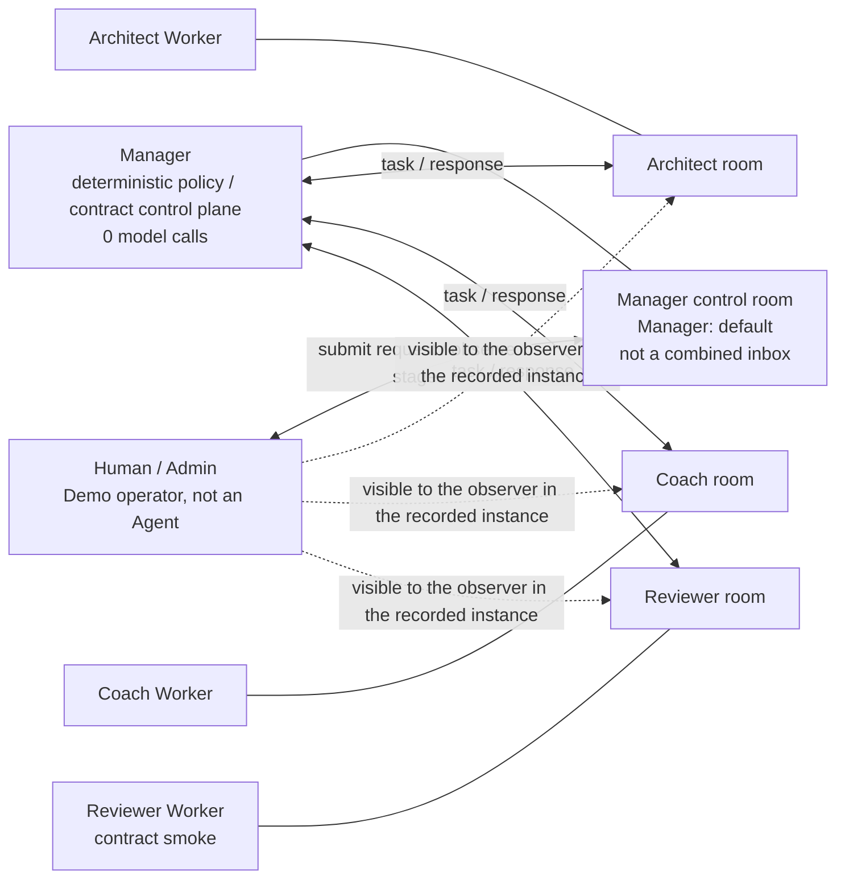

# Three-minute judge guide: how the agents collaborate

[中文导览](JUDGE_GUIDE.md) · [English guide](JUDGE_GUIDE.en.md) · [中文 Skill 总览](SKILLS_OVERVIEW.md) · [English Skills overview](SKILLS_OVERVIEW.en.md)

> This page explains the Awakening Demo's room topology, run sequence, and evidence trace in plain language.
>
> The Demo shows a real `1 Manager + 3 Worker` flow executed against a fixed synthetic job package. It is not M5 acceptance, does not prove outcomes for a real job seeker, and does not support model-selected Workers, tools, or plans.

## The 30-second answer

- This is not one group chat containing all four agents.
- `Manager: default` is one control room where the Human/Admin interacts with the Manager. It is not a combined inbox for every Manager conversation.
- The Manager communicates with Architect, Coach, and Reviewer through three separate Worker rooms.
- Long Worker JSON replies remain on their corresponding Worker paths. The Manager control room primarily shows dispatch, completion, and a `summary-completed` status/result-hash projection.
- The Manager makes no model call. Each of the three Workers makes one Provider call; the Reviewer only performs a narrowly scoped contract smoke, not a formal business review.
- Each successful run leaves `1 + 3 + 3 + 1 = 8` Matrix lifecycle projections in the Manager control room together with verifiable roles, run IDs, and SHA-256 hashes. These eight projections exclude the original Human request and the Worker-room task/response bodies.

Open these directly:

- [Judge overview of all nine Skills](SKILLS_OVERVIEW.en.md)
- [Successful-run evidence and limitations](../EVIDENCE.md)
- [Run B Matrix lifecycle projection](../evidence/run-b/matrix-flow.jsonl)
- [Three Run B canonical Worker outputs](../evidence/run-b/outputs/)

## 1. Who is who

| Name | Plain-language meaning | Model call? |
|---|---|---:|
| Human / Admin | Starts the Demo and observes the Element interface | No |
| Manager | Deterministic control plane for routing, validation, correlation, and summary generation | No; `0` in this Demo |
| Architect | Analyzes gaps between a role and an evidence project | Yes |
| Coach | Checks task execution and evidence preparation | Yes |
| Reviewer | Validates the input/output contract of a closed synthetic fixture | Yes, but only as a contract smoke |

The Manager is not an LLM planner that freely reasons about or changes a plan. The role set, Skill mapping, and call plan are frozen in code and registries.

## 2. Room topology: not one four-agent group chat



Solid lines show the Demo's core communication relationships. Dashed lines into the Worker rooms show the Human/Admin visibility observed in the recorded instance; they must not be generalized into a universal membership-count guarantee for every AgentTeams deployment.

The most important point is:

> `Manager: default` is only one Matrix room. The Manager publishing lifecycle stages and a summary there does not mean that every message from the three other Worker rooms is automatically copied into it.

## 3. The five steps in one Demo run

1. **The Human starts the request.** The Human/Admin posts one fixed synthetic request, with a `demo_request_id` and `demo_run_id`, in the Manager control room.
2. **The Manager creates three fixed paths.** Using the frozen role-to-Skill mapping, the Manager sends the corresponding trusted package to Architect, Coach, and Reviewer. The three Worker calls may run concurrently; the Manager itself makes no model call.
3. **The Workers process their own tasks.** Architect and Coach make representative live calls. Reviewer makes a no-tool contract-smoke live call. Each Worker receives only the structured task package assigned to it.
4. **The Manager validates and correlates the three results.** The orchestration layer waits for the Worker replies, checks each output against its Schema, and correlates input and output by role, run ID, event ID, and hash.
5. **The Manager creates a deterministic aggregate and projects state.** The orchestration layer writes all three results into `result.json` under fixed rules. The Manager control room publishes a `summary-completed` status/result-hash projection; it does not create a separate human-readable synthesis.

The Manager-control-room lifecycle-projection count for one successful run is:

```text
request-accepted   ×1
worker-dispatched  ×3
worker-completed   ×3
summary-completed  ×1
---------------------
total              8
```

These eight records count only Manager-control-room lifecycle projections. They exclude the original Human request and Worker-room tasks and replies. `result.json` is the deterministic aggregate of all three results; `summary-completed` is only a status/result-hash projection, not a verbatim copy of the three long Worker JSON replies and not a newly written human-readable synthesis.

## 4. What appears in the Manager and Worker rooms

| Location | What it mainly shows | What should not be expected there |
|---|---|---|
| Manager control room | Human request, `worker-dispatched`, `worker-completed`, `summary-completed`, target role, and evidence hash | All three complete Worker JSON replies automatically combined into one group-chat transcript |
| Architect room | The Manager's task for Architect and Architect's structured reply | Coach or Reviewer task text |
| Coach room | The Manager's task for Coach and Coach's structured reply | Architect or Reviewer task text |
| Reviewer room | The Manager's closed fixture for Reviewer and Reviewer's contract-smoke reply | A formal business-review conclusion or another Worker's context |
| Public `evidence/` | Sanitized lifecycle projections, call and cost counts, hashes, and canonical Worker outputs | Raw Provider envelopes, complete prompts, full Matrix bodies, or raw membership lists |

Therefore, not seeing every Worker response body in the Manager room is not a broken chain. It is the expected behavior of the current point-to-point room topology. Showing a complete four-party conversation in a public room would require a separate observation-room or event-mirroring feature, which is outside this fixed Demo.

## 5. How to interpret the 2-person and 3-person badges

The recorded instance showed:

- a `2` member badge in `Manager: default`;
- a `3` member badge in the Worker rooms.

The accurate claims are:

| Topic | What can be claimed | What must not be generalized |
|---|---|---|
| Manager control room | When `peer_user_id=none`, the reference Demo control code requires exactly Human + Manager; the recorded instance also showed two members | This does not establish that every Matrix Manager room always contains exactly two members |
| Worker room | The separately submitted recording UI showed a three-member badge; code only guarantees that the Manager and target Worker are present and restricts the registered Worker to that single target Worker | Code does not prove that the third member must be Human/Admin and does not guarantee that total membership always equals three |
| Public evidence package | It provides a safe projection of room lifecycle stages and hashes | It does not publish the raw `joined_members` list, so identities cannot be reconstructed from the safe projection alone |

Reference implementation:

- [Exact Manager control-room membership check](../infra/agentteams/demo/runtime/demo-matrix-control.sh)
- [Worker-room target-role scope check](../infra/agentteams/m4/runtime/m4-matrix-dispatch.sh)

The safe wording is therefore “the recorded instance showed 2/3 members,” not “all AgentTeams Manager/Worker rooms are inherently fixed at 2/3 members.”

## 6. Why use three separate Worker rooms

1. **Reduce context leakage between roles.** The current Demo does not automatically mirror one Worker's task body into another Worker's room, reducing the risk of cross-role context contamination.
2. **Keep responsibilities independent.** Architect performs gap analysis, Coach checks task and evidence preparation, and Reviewer performs only a restricted contract smoke.
3. **Let the Manager control each input path.** The Manager creates three trusted packages according to frozen registries and Schemas. Workers do not change routing, tools, or write permissions by themselves.
4. **Make attribution easier.** Each path records its target role, input-package hash, and output hash, making it possible to distinguish within the public package which Worker path succeeded or failed. These hashes establish only internal consistency between packaged canonical outputs and projections.
5. **Keep the human interface concise while retaining auditability.** The Manager room primarily shows stages and a summary; three canonical Worker outputs are distributed under `evidence/`.

## 7. How one result is traced from dispatch to output

For the Architect path:

```text
same demo_request_id / demo_run_id
        |
        +--> target = role_project_architect
        |
        +--> worker-dispatched
        |       evidence_event_id = delivery_id (in live Matrix)
        |       evidence_sha256   = trusted_package_sha256
        |
        +--> worker-completed
        |       evidence_event_id = response_event_id (in live Matrix)
        |       evidence_sha256   = output_sha256
        |
        `--> evidence/run-*/outputs/role_project_architect.json
                canonicalization should produce the same output_sha256
```

| Field | Purpose |
|---|---|
| `demo_request_id` | Identifies one Human request |
| `demo_run_id` / `core_run_id` | Identifies one execution run |
| `target` / `agent_identity_id` | Identifies which Worker owns the result |
| `delivery_id` | Matrix event ID created when the Manager dispatches the task |
| `response_event_id` | Matrix event ID created when the Worker returns its result |
| `trusted_package_sha256` | Hash of the fixed input package dispatched to the Worker |
| `output_sha256` | Hash of the Worker's canonical output |
| `evidence_sha256` | Input, output, or final-result hash bound into a Manager lifecycle event |

### Public-evidence boundary

The public `matrix-flow.jsonl` is a sanitized safe projection. It retains request/run IDs, phase, target, evidence kind, and evidence SHA-256, but does not distribute raw `delivery_id`, `response_event_id`, complete Matrix event bodies, or membership lists.

Consequently:

- the recording can show event IDs from the live Matrix rooms;
- the public package can recheck a canonical Worker output against its `output_sha256`;
- the public package cannot reconstruct raw Matrix event IDs from the sanitized projection alone;
- hashes establish only internal consistency between canonical files and safe projections in the public package. They do not independently prove raw Matrix/Provider transport, establish that synthetic content is a real business fact, or turn a locally calculated amount into a Provider bill.

## 8. Where to inspect the Skills

The repository distributes nine Skills, but “distributed” does not mean “all nine made live model calls.” The accurate scope is:

- `3 live`: Architect, Coach, and Reviewer;
- Reviewer is a narrowly scoped contract-smoke live Worker;
- `3 contract_only`: definition, Schema, and examples are present, but the Skills were not activated in these runs;
- `3 deny_only`: safety boundaries that prove high-risk capabilities fail closed.

Entry points:

- [Judge overview of all nine Skills](SKILLS_OVERVIEW.en.md)
- [Skill source directories](../skills/awakening/)
- [Skill Registry](../contracts/m4/skill-registry.json)
- [Input/output Schemas](../schemas/m4/)

## 9. What this page does and does not support

### Supported

- A fixed synthetic package completed a real `1 Manager + 3 Worker` flow twice.
- Architect, Coach, and Reviewer each produced one canonical structured output.
- The Manager control room retained eight lifecycle projections per successful run; this count excludes the original Human request and Worker-room tasks/responses.
- Manager Provider calls were `0`, Worker Provider calls were `3`, and retries were `0`.
- Worker results can be correlated by role and hash.
- Not copying every long Worker JSON reply into the Manager room is consistent with the current separate-room topology.

### Not supported

- The Manager autonomously planned or selected Workers using a model.
- Reviewer completed a formal job-seeker business review.
- A business-state write after Human approval succeeded in this Demo.
- The public package can reconstruct every raw Matrix message, membership list, or Provider transport envelope.
- The recorded 2/3 member badges are a universal fixed rule for every AgentTeams deployment.
- Synthetic Demo results are the final outcomes of a real job seeker.

For the complete technical boundaries, see [System architecture](ARCHITECTURE.md) and [Evidence index](../EVIDENCE.md).

---

**中文摘要：** 本 Demo 使用确定性的 Manager 控制面和三个独立的 Manager-to-Worker 房间，而不是一个四 Agent 群聊。Manager 发布生命周期投影，其中 `summary-completed` 只包含状态与结果哈希；`result.json` 保存确定性聚合，不是人类可读综合摘要。完整 canonical Worker 输出保持独立可核验。公开证据有意排除原始成员列表和事件 ID。
