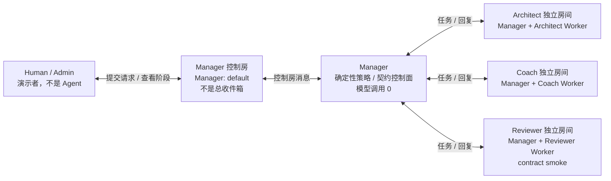

# 评委 3 分钟导览：多 Agent 如何协作

[中文导览](JUDGE_GUIDE.md) · [English guide](JUDGE_GUIDE.en.md) · [中文 Skill 总览](SKILLS_OVERVIEW.md) · [English Skills overview](SKILLS_OVERVIEW.en.md)

> 本页用非专业语言解释 Awakening Demo 的房间关系、运行过程和证据追踪方式。
>
> 本 Demo 展示的是固定 synthetic job package 上真实运行过的 `1 Manager + 3 Worker` 流程。它不是 M5 验收，不证明真实求职者成效，也不支持模型自主选择 Worker、工具或计划。

## 30 秒结论

- 这不是把 4 个 Agent 全部拉进一个群聊。
- `Manager: default` 只是 Human/Admin 与 Manager 交互的一个控制房间，不是 Manager 所有对话的总收件箱。
- Manager 分别通过三个 Worker 房间与 Architect、Coach、Reviewer 交互。
- Worker 的长 JSON 回复保留在对应 Worker 路径中；Manager 控制房主要展示派发、完成和 `summary-completed` 状态/结果哈希投影。
- Manager 不调用模型。三个 Worker 各完成一次 Provider 调用；其中 Reviewer 只做范围受限的契约冒烟，不是正式业务评审。
- 每次成功运行留下 `1 + 3 + 3 + 1 = 8` 条 Manager 控制房 Matrix 阶段投影，以及可核验的角色、运行 ID 和 SHA-256 哈希；这 8 条不包含 Human 原始请求，也不包含 Worker 房的 task/response 正文。

直接查看：

- [9 个 Skill 评委总览](SKILLS_OVERVIEW.md)
- [成功运行证据与限制](../EVIDENCE.md)
- [Run B Matrix 阶段投影](../evidence/run-b/matrix-flow.jsonl)
- [Run B 三份 canonical Worker 输出](../evidence/run-b/outputs/)

## 1. 谁是谁

| 名称 | 通俗理解 | 是否调用模型 |
|---|---|---:|
| Human / Admin | 发起 Demo、查看 Element 界面的人 | 否 |
| Manager | 固定路由、校验、关联和汇总的控制面 | 否；本 Demo 为 `0` |
| Architect | 分析角色与项目缺口 | 是 |
| Coach | 检查执行任务和证据准备 | 是 |
| Reviewer | 验证封闭 synthetic fixture 的输入/输出契约 | 是，但仅为 contract smoke |

Manager 不是会自由思考和改计划的 LLM planner。角色集合、Skill 映射和调用计划都由代码与 Registry 预先冻结。

## 2. 房间拓扑：不是一个四 Agent 群聊



图中只画本 Demo 的核心通信关系。录屏实例里 Human/Admin 也能看到 Worker 房间，但这是 UI 观察，不是代码对所有部署作出的成员数保证；准确边界见下方“如何理解界面上的 2 人和 3 人”。

最重要的一点是：

> `Manager: default` 只是一个 Matrix 房间。Manager 在这个房间中显示生命周期与汇总，并不意味着其他三个 Worker 房间的全部消息会自动复制进来。

## 3. 一次 Demo 的五步流程

1. **Human 发起请求。** Human/Admin 在 Manager 控制房发送一条带 `demo_request_id` 和 `demo_run_id` 的固定 synthetic 请求。
2. **Manager 拆成三路固定任务。** Manager 按冻结的角色—Skill 映射，把对应 trusted package 分别派给 Architect、Coach 和 Reviewer。三路 Worker 调用可以并发；Manager 自身不调用模型。
3. **三个 Worker 分别处理。** Architect 和 Coach 进行 representative live call；Reviewer 进行 no-tool contract-smoke live call。每个 Worker 只收到分配给自己的结构化任务包。
4. **Manager 校验并关联三路结果。** 编排层等待 Worker 回复，检查输出能否通过对应 Schema，并用角色、运行 ID、事件 ID 和哈希关联输入与输出。
5. **Manager 生成确定性聚合并投影状态。** 编排层把三路结果按固定规则写入 `result.json`；Manager 控制房发布 `summary-completed` 状态与结果哈希投影，不生成一段人类可读的综合摘要。

一次成功 run 在 Manager 控制房中的阶段投影计数是：

```text
request-accepted   ×1
worker-dispatched  ×3
worker-completed   ×3
summary-completed  ×1
---------------------
total              8
```

这 8 条只统计 Manager 控制房中的阶段投影，不含 Human 原始请求，也不含 Worker 房间中的任务和回复。完整三路结果由 `result.json` 确定性聚合；`summary-completed` 只是状态与结果哈希投影，不是把三个 Worker 的长 JSON 原样复制到 Manager 房间，也不是另写一段人类可读的综合摘要。

## 4. Manager 房和 Worker 房分别能看到什么

| 位置 | 主要看到什么 | 不应期待看到什么 |
|---|---|---|
| Manager 控制房 | Human 请求、`worker-dispatched`、`worker-completed`、`summary-completed`、目标角色与证据哈希 | 三个 Worker 的全部长 JSON 自动汇集成一段群聊 |
| Architect 房间 | Manager 发给 Architect 的任务、Architect 的结构化回复 | Coach 或 Reviewer 的任务正文 |
| Coach 房间 | Manager 发给 Coach 的任务、Coach 的结构化回复 | Architect 或 Reviewer 的任务正文 |
| Reviewer 房间 | Manager 发给 Reviewer 的关闭式 fixture、Reviewer 的 contract-smoke 回复 | 正式业务评审结论，或其他 Worker 的上下文 |
| 公开 `evidence/` | 脱敏阶段投影、费用与调用计数、哈希、canonical Worker outputs | 原始 Provider 传输包、完整 prompt、全部 Matrix 正文和原始成员列表 |

因此，“Manager 房没有显示全部 Worker 正文”不是链路失败，而是当前点对点房间拓扑的预期行为。如果未来希望在一个公共房间中看到四方完整对话，需要额外实现观察室或事件镜像；该功能不属于本次固定 Demo。

## 5. 如何理解界面上的 2 人和 3 人

录屏实例中曾观察到：

- `Manager: default` 的成员徽标显示 `2`；
- Worker 房间的成员徽标显示 `3`。

准确口径如下：

| 内容 | 可以声明什么 | 不能扩大声明什么 |
|---|---|---|
| Manager 控制房 | 参考 Demo 控制代码在 `peer_user_id=none` 时要求成员精确为 Human + Manager；录屏实例也显示 2 人 | 不能据此推断所有 Matrix Manager 房都固定只有两人 |
| Worker 房间 | 另行提交的录屏 UI 显示成员徽标为 3；代码只保证 Manager 与目标 Worker 在房间中，并把 registered Worker 限定为该单一目标 Worker | 代码不证明第三名成员必然是 Human/Admin，也不保证总成员数恒为 3 |
| 公开证据包 | 提供房间阶段和哈希的安全投影 | 不公开原始 `joined_members` 列表，不能只靠安全投影还原成员身份 |

对应参考实现：

- [Demo 控制房精确成员校验](../infra/agentteams/demo/runtime/demo-matrix-control.sh)
- [Worker 房间目标角色范围校验](../infra/agentteams/m4/runtime/m4-matrix-dispatch.sh)

所以应写“录屏实例中观察到 2/3 人”，而不是写“AgentTeams 的所有 Manager/Worker 房间天然固定为 2/3 人”。

## 6. 为什么采用三个独立 Worker 房间

1. **减少上下文串线。** 一个 Worker 的任务正文不会被当前 Demo 自动镜像到另一个 Worker 房间，降低角色相互污染上下文的风险。
2. **保持角色职责独立。** Architect 负责缺口分析，Coach 负责任务与证据准备，Reviewer 只做受限契约冒烟。
3. **Manager 控制每路输入。** Manager 按固定 Registry 和 Schema 生成三份 trusted package。Worker 不自行改变路由、工具或写入权限。
4. **容易定位结果来源。** 每路记录都有目标角色、输入包哈希和输出哈希，可在公开包内部区分是哪条 Worker 路径成功或失败；这些哈希只证明包内 canonical 输出与投影记录内部一致。
5. **人类界面保持简洁，审计者仍可检查结果。** Manager 房主要显示阶段与汇总；三份 canonical Worker outputs 随 `evidence/` 分发。

## 7. 一条结果如何从派发追踪到输出

以 Architect 为例：

```text
同一 demo_request_id / demo_run_id
        |
        +--> target = role_project_architect
        |
        +--> worker-dispatched
        |       evidence_event_id = delivery_id（live Matrix 中）
        |       evidence_sha256   = trusted_package_sha256
        |
        +--> worker-completed
        |       evidence_event_id = response_event_id（live Matrix 中）
        |       evidence_sha256   = output_sha256
        |
        `--> evidence/run-*/outputs/role_project_architect.json
                canonicalize 后应得到同一个 output_sha256
```

| 字段 | 作用 |
|---|---|
| `demo_request_id` | 标识这一条 Human 请求 |
| `demo_run_id` / `core_run_id` | 标识这一轮执行 |
| `target` / `agent_identity_id` | 标识结果属于哪个 Worker |
| `delivery_id` | Manager 向 Worker 派发任务时的 Matrix 事件 ID |
| `response_event_id` | Worker 返回结果时的 Matrix 事件 ID |
| `trusted_package_sha256` | 分发给 Worker 的固定输入包哈希 |
| `output_sha256` | Worker canonical 输出的哈希 |
| `evidence_sha256` | Manager 阶段事件中绑定的输入、输出或最终结果哈希 |

### 公开证据的边界

公开的 `matrix-flow.jsonl` 是脱敏安全投影，保留 request/run ID、phase、target、evidence kind 和 evidence SHA-256。它不分发原始 `delivery_id`、`response_event_id`、完整 Matrix 事件正文或成员列表。

因此：

- 录屏可以展示 live Matrix 中的事件 ID；
- 公开包可以重新核对 canonical Worker output 与 `output_sha256`；
- 公开包不能仅凭脱敏投影重建原始 Matrix 事件 ID；
- 哈希只证明公开包内 canonical 文件与安全投影记录内部一致；它不独立证明原始 Matrix/Provider 传输，不自动证明 synthetic 内容等于真实业务事实，也不等于 Provider 账单。

## 8. Skill 从哪里看

本仓库随附 9 个 Skill，但“随包”不等于“全部进行了 live 模型调用”。准确范围是：

- `3 live`：Architect、Coach、Reviewer；
- 其中 Reviewer 是范围受限的 contract-smoke live；
- `3 contract_only`：有定义、Schema 和样例，本次运行未激活；
- `3 deny_only`：用于证明高风险能力会失败关闭。

入口：

- [9 个 Skill 评委总览](SKILLS_OVERVIEW.md)
- [Skill 源文件目录](../skills/awakening/)
- [Skill Registry](../contracts/m4/skill-registry.json)
- [输入输出 Schema](../schemas/m4/)

## 9. 本页支持和不支持的结论

### 支持

- 固定 synthetic package 曾两次完成真实 `1 Manager + 3 Worker` 流程；
- Architect、Coach 和 Reviewer 各产生一份 canonical 结构化输出；
- Manager 控制房留下 8 条阶段投影；该计数不包含 Human 原始请求或 Worker 房 task/response；
- Manager Provider 调用为 `0`，Worker Provider 调用为 `3`，retry 为 `0`；
- Worker 结果可按角色和哈希关联；
- Manager 房不复制所有 Worker 长 JSON，符合当前独立房间拓扑。

### 不支持

- Manager 由模型自主规划或自主选择 Worker；
- Reviewer 已完成正式求职业务评审；
- 人工批准后的业务写入已经在本 Demo 成功；
- 公开包能重建全部原始 Matrix 消息、原始成员列表或 Provider 传输包；
- 录屏中的 2/3 人徽标是所有 AgentTeams 部署的通用固定规则；
- synthetic Demo 结果就是某位真实求职者的最终成效。

完整技术边界见 [系统架构](ARCHITECTURE.md) 和 [证据说明](../EVIDENCE.md)。

---

**English summary:** this Demo uses a deterministic Manager control plane and three separate Manager-to-Worker rooms, not one four-agent group chat. The Manager publishes lifecycle projections, including a `summary-completed` status/result hash; `result.json` holds the deterministic aggregate, not a human-readable synthesis. Complete canonical Worker outputs remain separately auditable. The packaged evidence intentionally omits raw room membership and event IDs.
